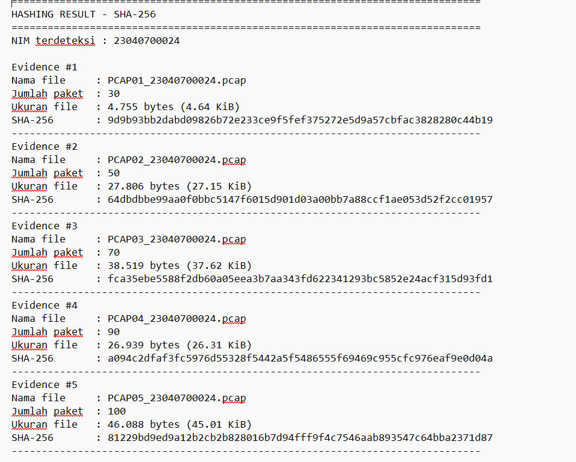
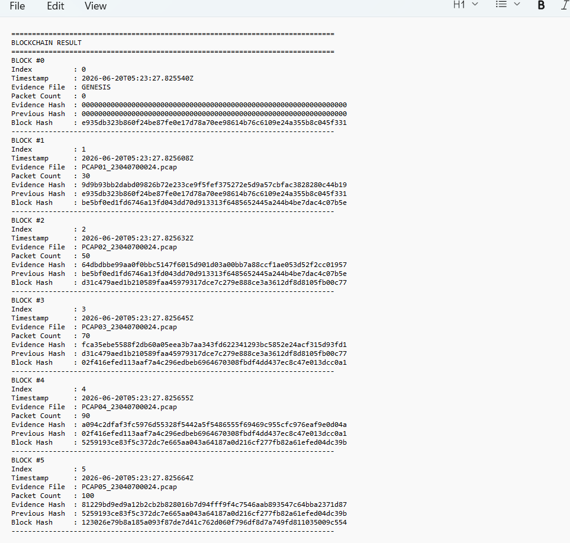
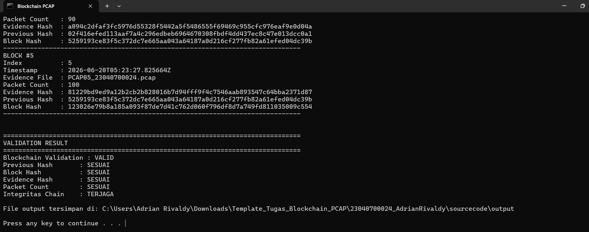

# Akuisisi Bukti Jaringan, SHA-256, dan Simulasi Blockchain

## Identitas Mahasiswa

- Nama: ADRIAN RIVALDY
- NIM: 23040700024
- Program Studi: INFORMATIKA
- Mata Kuliah: BLOCKCHAIN

## Deskripsi Tugas

Repository ini memuat hasil praktikum akuisisi lalu lintas jaringan dalam format PCAP, perhitungan hash SHA-256 sebagai identitas digital bukti, simulasi blockchain sederhana, dan validasi integritas blockchain serta file bukti.

Blockchain terdiri dari satu Genesis Block dan lima Evidence Block. Setiap Evidence Block menyimpan nama file, jumlah paket, hash SHA-256 bukti, previous hash, dan block hash.

## Tools yang Digunakan

- Wireshark untuk akuisisi lalu lintas jaringan
- Editcap untuk membagi master capture dan mengubah format menjadi PCAP klasik
- Python 3 untuk hashing, pembuatan blockchain, dan validasi
- GitHub untuk penyimpanan repository

## Struktur Folder

```text
NIM_Nama/
├── evidence/
│   ├── PCAP01_NIM.pcap
│   ├── PCAP02_NIM.pcap
│   ├── PCAP03_NIM.pcap
│   ├── PCAP04_NIM.pcap
│   └── PCAP05_NIM.pcap
├── sourcecode/
│   ├── blockchain_pcap.py
│   ├── split_pcap.bat
│   ├── jalankan_program.bat
│   └── output/
├── screenshot/
│   ├── hashing_result.png
│   ├── blockchain_result.png
│   └── validation_result.png
├── report/
│   └── laporan.pdf
└── README.md
```

## Dataset PCAP

| File | Jumlah Paket |
|---|---:|
| PCAP01_NIM.pcap | 30 |
| PCAP02_NIM.pcap | 50 |
| PCAP03_NIM.pcap | 70 |
| PCAP04_NIM.pcap | 90 |
| PCAP05_NIM.pcap | 100 |

## Cara Menjalankan

1. Pastikan kelima file PCAP berada di folder `evidence`.
2. Pastikan nama file memakai NIM yang sama.
3. Buka folder `sourcecode`.
4. Klik dua kali `jalankan_program.bat`.

Alternatif melalui Command Prompt:

```bash
cd sourcecode
python blockchain_pcap.py
```

Simulasi manipulasi data:

```bash
python blockchain_pcap.py --tamper-demo
```

## Screenshot Hasil

### Hasil Hashing



### Hasil Blockchain



### Hasil Validasi



## Hasil Validasi Blockchain

```text
Blockchain Validation : VALID
Previous Hash       : SESUAI
Block Hash          : SESUAI
Evidence Hash       : SESUAI
Packet Count        : SESUAI
Integritas Chain    : TERJAGA
```

Hasil tersebut menunjukkan bahwa setiap block terhubung dengan benar, block hash sesuai dengan perhitungan ulang, dan hash file PCAP masih sama dengan hash yang disimpan dalam blockchain.
